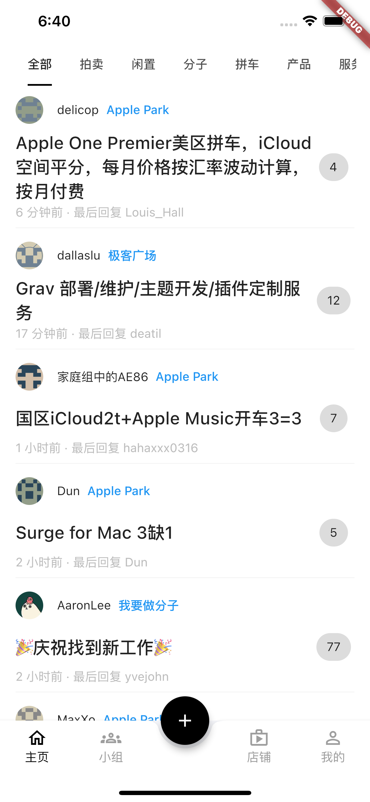
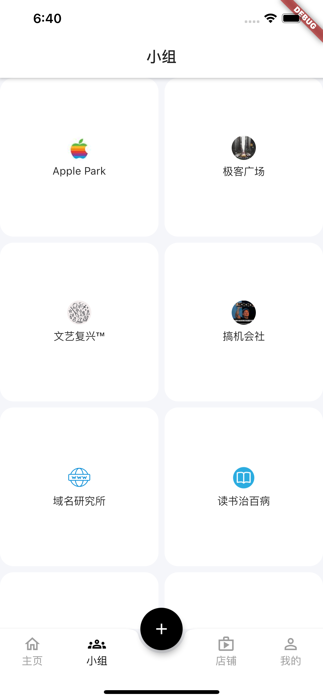
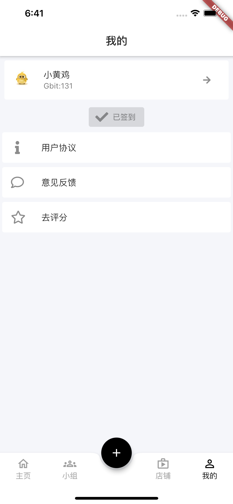
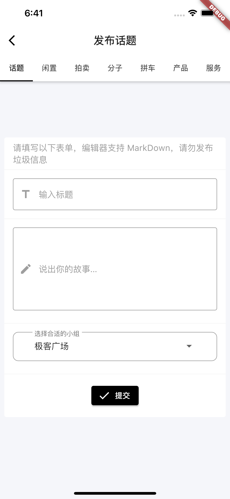

# Geekhub

由 Flutter 构建的 [geekhub](https://www.geekhub.com/) App

## 支持 Geekhub

Geekhub 是采用 MIT 许可的开源项目，使用完全免费。

觉得不错的话，可以通过下列的方法来赞助 Geekhub 的开发.

### 周期性赞助

周期性赞助可以获得额外的回报，比如更快的 GitHub 响应或者你的名字会出现在 Geekhub 的 GitHub 仓库.

*   通过 [爱发电](https://afdian.net/@leetao) 赞助

*   给我们发邮件联系赞助事宜: leetao@email.cn

### 一次性赞助

我们通过以下方式接受赞助:

*   [支付宝](http://ww1.sinaimg.cn/large/006wYWbGly1fm10itkjb6j30aj0a9t8w.jpg)

*   [微信支付](http://ww1.sinaimg.cn/large/006wYWbGly1gucyjbbwtej60eu0fnaap02.jpg)

## 作者

Geekhub 由 Leetao 制作，在 MIT 协议 下开源。
